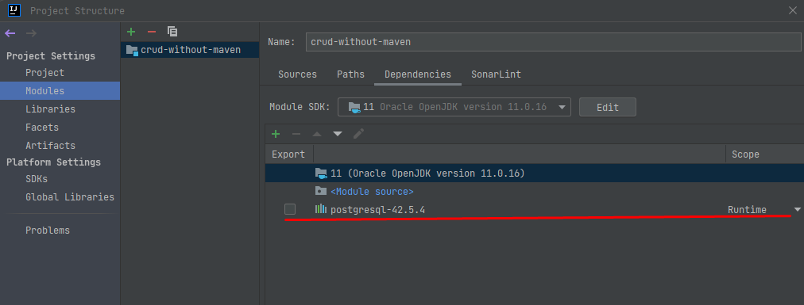

# Sobre

Projeto exemplificando operações CRUD. Neste, não é feito uso de maven ou da API Java para persistênica.

Este irá simular atividades de gerenciamento de uma escola, como, por exemplo, cadastro de professores, alunos, ofertas de disciplinas e matrículas.

Uma evolução deste pode ser encontrada [aqui](https://github.com/fysabelah/crud-school-hibernate).

_Observação_
Para executar, será necessário adicionar o driver do PostgreSQL. O download por ser feito [aqui](https://jdbc.postgresql.org/download/). As configurações para adição do mesmo pode ser vista abaixo.

